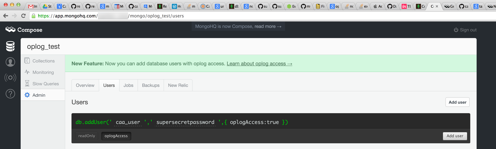

# Reactive Mongo

This module allows you to subscribe to events, based on what's shakin' in your MongoDB.

## How?

MongoDB uses an [oplog](http://docs.mongodb.org/manual/core/replica-set-oplog/) (short for "operation log") to sync a master to its slaves. Most databases have some form of replication files.

## Working on local

If you're on a local instance of MongoDB, you'll likely have to configure it to write to the oplog.

First run MongoDB with the following settings

```sh
$ sudo mongod --replSet rs0 --oplogSize 100
```

In the same terminal you'll probably see a repeating error.

```
2014-09-08T15:55:16.748-0700 [rsStart] replSet can't get local.system.replset config from self or any seed (EMPTYCONFIG)
2014-09-08T15:55:17.749-0700 [rsStart] replSet can't get local.system.replset config from self or any seed (EMPTYCONFIG)
2014-09-08T15:55:18.750-0700 [rsStart] replSet can't get local.system.replset config from self or any seed (EMPTYCONFIG)
2014-09-08T15:55:19.751-0700 [rsStart] replSet can't get local.system.replset config from self or any seed (EMPTYCONFIG)
2014-09-08T15:55:20.752-0700 [rsStart] replSet can't get local.system.replset config from self or any seed (EMPTYCONFIG)
```

This is fine. Just temporary.

Now, begin a Mongo client connection, and do the following.

```sh
$ mongo
> use local
switched to db local
> rs.initiate()
{
  "info2" : "no configuration explicitly specified -- making one",
  "me" : "Your-MacBook-Pro.local:27017",
  "info" : "Config now saved locally.  Should come online in about a minute.",
  "ok" : 1
}
```

Now, in the same client, if you run `show collections` you should see some new ones for the oplog.

Go back to the `mongod` terminal and restart it. The errors should go away, and you'll be ready to use Reactive Mongo.

## Working on Compose (formerlly MongoHQ)

You must use a database that has elastic search turned on.

Use a database user who has `oplogAccess` enabled.



In the settings for the database, you'll see an example of how to connect to the database. It will look something like

```
mongodb://<user>:<password>@candidate.35.mongolayer.com:10491,candidate.34.mongolayer.com:10493/oplog_test
```

In this example `oplog_test` is the database name. Tweak that slightly. Instead of ending in `/oplog_test` change it to be `/local?authSource=oplog_test`.

```
mongodb://<user>:<password>@candidate.35.mongolayer.com:10491,candidate.34.mongolayer.com:10493/local?authSource=oplog_test
```

Use this path to connect to your database and tail the oplog.
